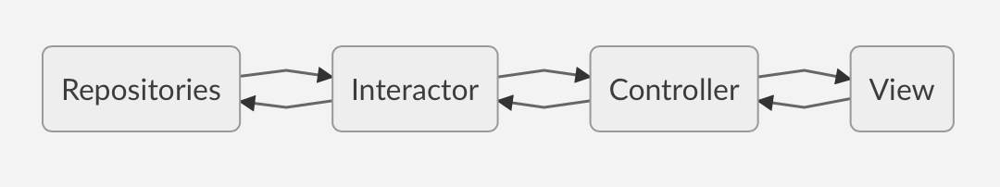

# SupaGithub documentation for  app

This repository contains a detailed sample app that implements MVVM / VIP architecture.
## General information

1. [Components](#components)
2. [Dependency Management](#dependency-management)
3. [Architecture](#architecture)


## Components

### SupaGithub
This is the iOS app target for SupaGithub and contains the app delegate and other app-specific resources, such as the info.plist. Other than the app delegate, this target does not contain any source

### SupaGithubCoreKit

SupaGithubCoreKit is the component in charge of communicating with and parsing data from Sonic web services. It has also all business logic of the application.  This last Cocoa Touch Framework contains code that does not depend on UIKit. Therefore, this framework can be used in any Apple platform.

### SupaGithub_iOS

This Cocoa Touch Framework contains all the UI code specific to the SupaGithub iOS app, such as view controllers and views.

### CoordinatorKit

This Cocoa Touch Framework contains all the code base to implement the coordinator pattern. 

## Dependency Management

### Cocoapods
I use Cocoapods to manage the dependencies. All dependencies along with their checkouts are stored in the repo. Check [here](https://cocoapods.org) to install Cocoapods. 

```sh
$ pod install
```

### Externals libraries
- *Yalta* : a light library for auto layout
- *PromiseKit* : Promises for Swift
- *Reusable* : A Swift mixin for reusing views easily and in a type-safe way (tableviewCell, CollectionViewCel)
- *Moya* : Network abstraction layer written in Swift (I use it to make something quick but in real project I prefer do my own network layer)
- *KingFisher* : A lightweight, pure-Swift library for downloading and caching images from the web. 

## Architecture
This project uses a hybrid MVVM / VIP architecture with a few extra layers.

The architecture is broken down in 4 distinct layers.



Communication flows strictly between each layer and its neighbours.

### AppDependcy Container
The `AppDepencyContainer` manage dependency of the entire app. For this project, I made everything in the appDependencyContainer, but in a real project you have to break it by module of the app. For example if you have onBoarding and dashboard in your app, You can create a dependencyContainer for Onboarding and one for dashboard.

### Repositories
Repositories are the intermediary layer between data sources and the app. Any class using a repository is agnostic of where the data they are requesting comes from. It could be from the internet using for example the `SonicApi` or it could be retrieving data from cache or userdefaults. 

Repositories transform their received data to Models defined in the App space. No Kit models are exposed past the Repository layer


### Interactors/ViewModels
Interactors is the interface to the view which contains the business logic. In this architecture a Interactor is the VIP equivalent of a Interactor + Presenter. In normal MVVM the ViewModel represents a Interactor + Presenter, so i decid to name them according to the specific case requirements. If it has to interact with the view and the services and deal with user interactions passed from the views then it is an Interactor. If it's just a data provider with stored or computed properties then it is a viewModel..


### View
Any view that has an Interactor has to follow a few guidelines.

- All output from the Interactor comes from the Interactors ViewState value. 

- All input to the Interactors happens through functions.

- Views are not allowed to interface with any layer lower than the Interactor in the architecture hierarchy.

- Every TableView/CollectionView Cell generally has it's own cell view model which are held by the parent ViewControllers viewModel.

- View to View/Controller communication is handled with Delegation. All subviews and presented view controllers have to rely on the parent or presenting view for dismissal.
- All Controller has to be conform to `BaseView`
- View can be made in code or in Xib

- Coordinator are used for managing the navigation, the screen hierarchy and passing data between the interactors as needed.
